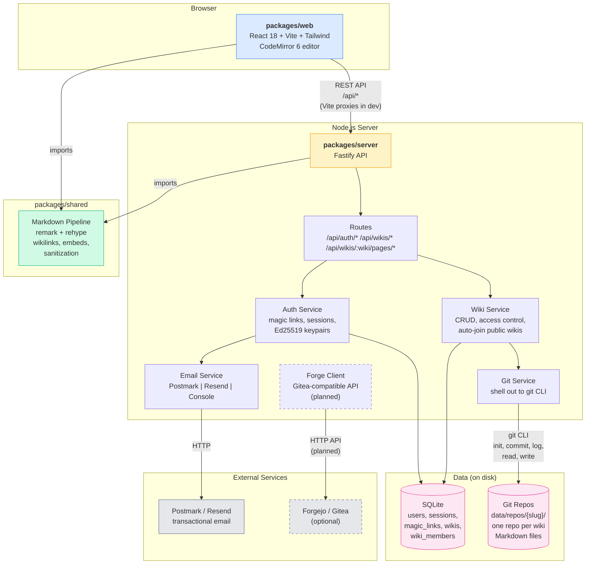

# Architecture Diagram



## Key relationships

| From | To | How |
|---|---|---|
| **Browser** | **Server** | REST API over HTTP. Vite dev server proxies `/api/*` to Fastify on port 4000. In production, Caddy reverse-proxies everything. |
| **Web** | **Shared** | Direct import. The browser renders Markdown client-side for page view and editor preview, using the same pipeline as the server. |
| **Server** | **Shared** | Direct import. Server-side rendering for API responses that include HTML. |
| **Server** | **SQLite** | Drizzle ORM. Stores users, sessions, wiki metadata, and membership. Not page content — that's in git. |
| **Server** | **Git repos** | Shells out to the `git` CLI. Each wiki is a bare-ish repo in `data/repos/{slug}/`. Every page edit is a commit. |
| **Server** | **Email** | HTTP API calls to Postmark or Resend. In dev mode, emails are logged to console. |
| **Server** | **Forgejo** | Planned. Will use Gitea-compatible REST API for repo creation, webhooks, SSH key registration. Dashed lines = not yet wired up. |

## File layout

```
hangarwiki/
├── packages/
│   ├── server/           # Fastify API server
│   │   └── src/
│   │       ├── routes/       auth.ts, wikis.ts, pages.ts
│   │       ├── services/     auth.ts, wiki.ts, git.ts, email.ts,
│   │       │                 crypto.ts, forge.ts, paths.ts
│   │       ├── db/           schema.ts, index.ts (SQLite + Drizzle)
│   │       ├── middleware/   auth.ts (session validation)
│   │       └── config.ts     env var getters
│   ├── web/              # React frontend
│   │   └── src/
│   │       ├── pages/        Login, WikiList, WikiHome, PageView,
│   │       │                 PageEdit, PageHistory
│   │       ├── components/   Editor (CodeMirror wrapper)
│   │       ├── hooks/        useAuth (context + provider)
│   │       ├── lib/          api.ts (REST client), markdown.ts
│   │       └── styles/       index.css (Tailwind + wikilink styles)
│   └── shared/           # Shared code (used by both)
│       └── src/markdown/
│           ├── wikilink.ts   extract [[links]] and ![[embeds]]
│           └── render.ts     unified/remark pipeline
└── data/                 # Runtime data (gitignored)
    ├── hangarwiki.db         SQLite database
    └── repos/                Git repos, one per wiki
        └── {wiki-slug}/
```
